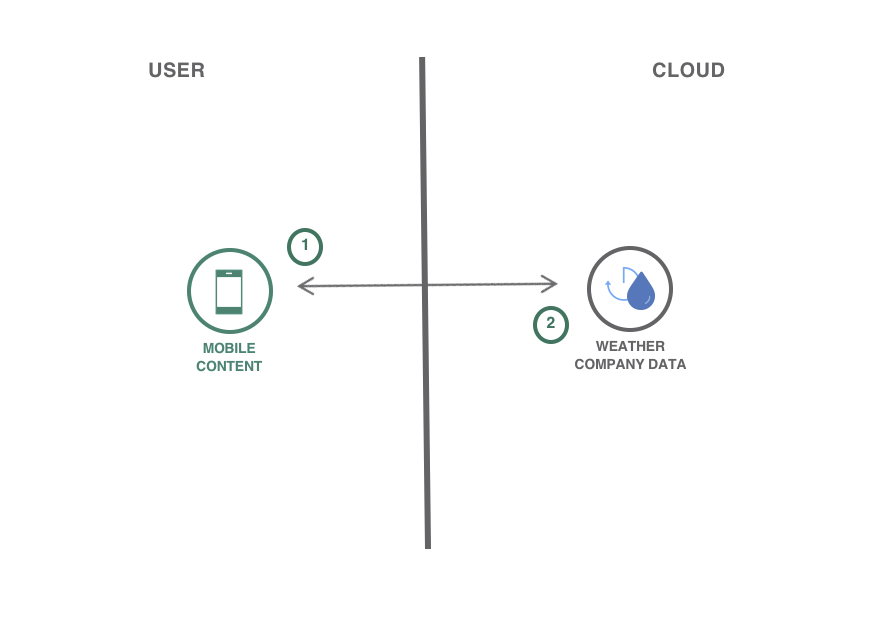

[](https://bluemix.net)
[](https://developer.android.com/index.html)

# Create an Android weather application in Java

> We have a similar pattern available for [iOS](https://github.com/IBM/weather-forecasting-ios), as well!

In this code pattern, you will create an Android weather forecasting app using Google Maps and the Weather Company Data service. Use this service to consume current conditions or hourly, daily, and intraday forecasts based on Google Maps geolocation coordinations of your user's device. Use this pattern to solve real business problems where weather has a significant impact on the outcome.

When you have completed this code pattern, you will understand how to:

* Provision and integrate the Weather Company Data service
* Use Geolocation information integrated with Google Maps
* Connect to additional IBM Cloud services



## Steps

> As an alternative to the steps below, you can [create this project as a starter kit on IBM Cloud](https://console.bluemix.net/developer/mobile/create-app?defaultDeploymentToolchain=&defaultLanguage=ANDROID&env_id=ibm%3Ayp%3Aus-south&starterKit=fad1d49e-f7b6-3aff-9b53-14673fca4399&tenantNavMode=true), which automatically provisions required services, and injects service credentials into a custom fork of this pattern. Then, you can skip directly to step 4 below.

1. [Install development tools](#1-install-development-tools)
1. [Authenticate with Google Maps](#2-authenticate-with-google-maps)
1. [Create a Weather service instance](#3-create-a-weather-service-instance)
1. [Run](#4-run)

### 1. Install development tools

Ensure you have the latest versions of [Android Studio](https://developer.android.com/studio/index.html) and [Gradle](https://gradle.org/gradle-download/) installed.

### 2. Authenticate with Google Maps

Open the project in Android Studio and perform a Gradle Sync.

[Obtain a Google Maps API Key from Google](https://developers.google.com/maps/documentation/android-sdk/signup).

Navigate to `res/values/google_maps_api.xml`, and input your API Key:

```xml
<resources>
    <string name="google_maps_key" templateMergeStrategy="preserve" translatable="false">YOUR_KEY_HERE</string>
</resources>
```

### 3. Create a Weather service instance

Use the [IBM Cloud Catalog](https://console.ng.bluemix.net/catalog/) and create a [Weather Company Data](https://console.ng.bluemix.net/catalog/services/weather-company-data/) service instance.

Navigate to `res/values/weather_credentials.xml` and input your credential information:

```xml
<resources>
    <string name="weather_username">YOUR_USERNAME_HERE</string>
    <string name="weather_password">YOUR_PASSWORD_HERE</string>
    <string name="weather_host">YOUR_HOST_HERE</string>
</resources>
```

Replace the service credentials from your Weather instance:


> **Note:** If one of your credentials has a special character (for example: `&`) you might need to escape it, as follows:  `&amp;`

### 4. Run

Click **Run** to start the app in Android Studio.


The application allows you determine the forecast of any location using your Weather instance on IBM Cloud. Long click to view the forecast.

## License

This code pattern is licensed under the Apache License, Version 2. Separate third-party code objects invoked within this code pattern are licensed by their respective providers pursuant to their own separate licenses. Contributions are subject to the [Developer Certificate of Origin, Version 1.1](https://developercertificate.org/) and the [Apache License, Version 2](https://www.apache.org/licenses/LICENSE-2.0.txt).

[Apache License FAQ](https://www.apache.org/foundation/license-faq.html#WhatDoesItMEAN)
