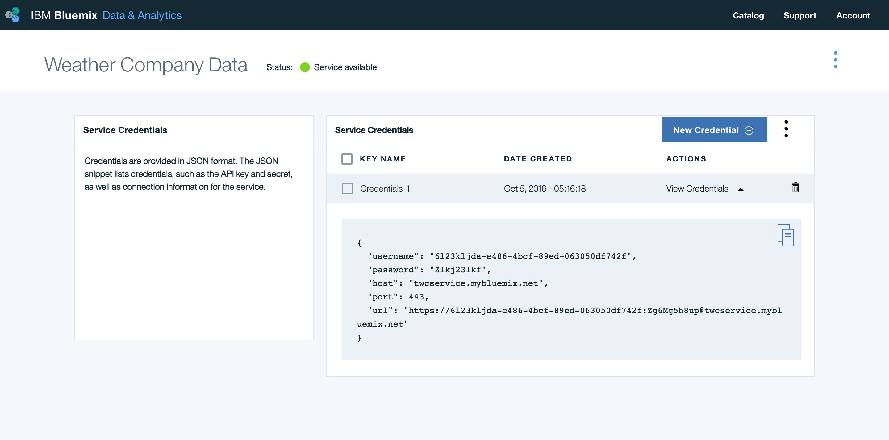
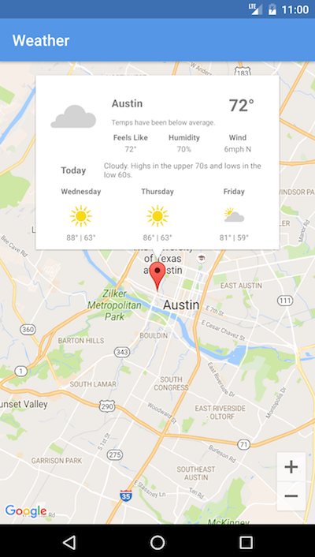

[](https://bluemix.net)
[](https://developer.android.com/index.html)

# Create an Android weather application in Java

The IBM Cloud Mobile Starter for Weather showcases getting a forecast using the coordinates from Google Maps and gives you integration points for each of the IBM Cloud Mobile services.

## Requirements

* An [IBM Cloud](http://bluemix.net) Account
* [Android Studio](https://developer.android.com/studio/index.html) and [Gradle](https://gradle.org/gradle-download/)
* [Weather](https://console.ng.bluemix.net/catalog/weather-company-data) service instance obtained from the [IBM Cloud Catalog](https://console.ng.bluemix.net/catalog/)

## Configuration

* Open the project in Android Studio and perform a Gradle Sync.
* Navigate to `res/values/google_maps_api.xml`, generate an API key, and input your credential information:

```HTML
<resources>
    <!--
    TODO: Before you release your application, you need a Google Maps API key.
    To do this, you can either add your release key credentials to your existing
    key, or create a new key.
    Note that this file specifies the API key for the release build target.
    If you have previously set up a key for the debug target with the debug signing certificate,
    you will also need to set up a key for your release certificate.
    Follow the directions here:
    https://developers.google.com/maps/documentation/android/signup
    Once you have your key (it starts with "AIza"), replace the "google_maps_key"
    string in this file.
    -->
    <string name="google_maps_key" templateMergeStrategy="preserve" translatable="false">YOUR_KEY_HERE</string>
</resources>
```
* Navigate to `res/values/weather_credentials.xml` and input your credential information:

```HTML
<resources>
    <string name="weather_username">YOUR_USERNAME_HERE</string>
    <string name="weather_password">YOUR_PASSWORD_HERE</string>
    <string name="weather_host">YOUR_HOST_HERE</string>
</resources>
```

Replace the service credentials from your Weather instance:



> **Note:** If one of your credentials has a special character (for example: `&`) you might need to escape it, as follows:  `&amp;`

## Run

Click **Run** to start the app in Android Studio.



The application allows you determine the forecast of any location using your Weather instance on IBM Cloud. Long click to view the forecast.

## License

[Apache 2.0](LICENSE)
